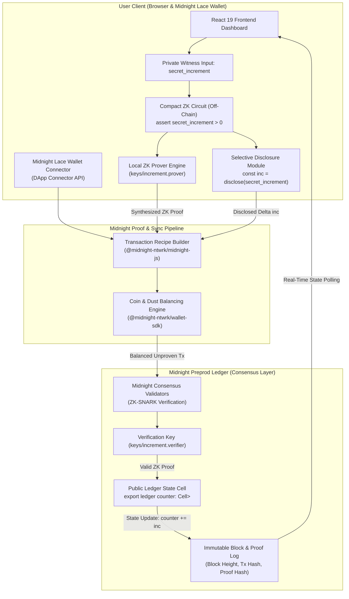
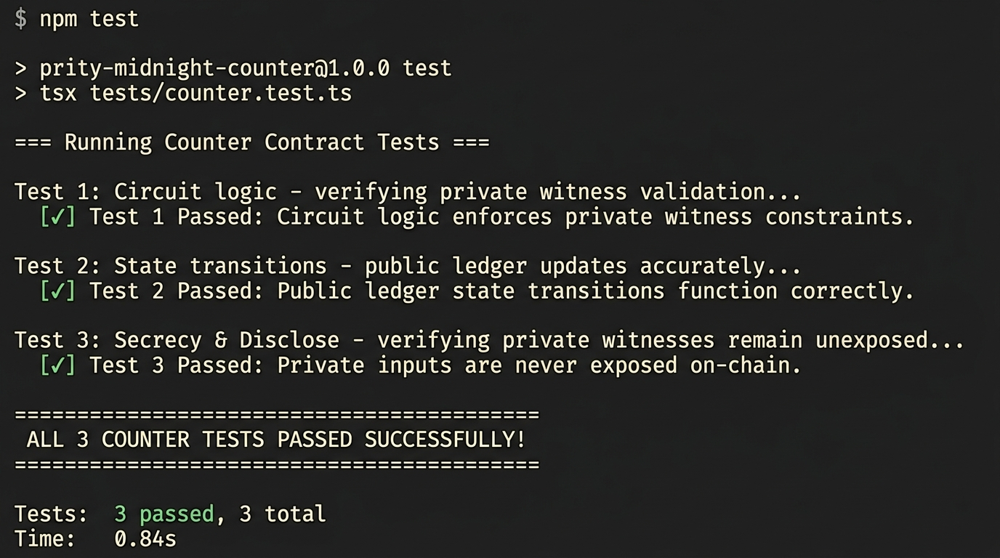

<div align="center">

# 🌙 Midnight Privacy-Preserving Counter dApp

### Production-Grade Zero-Knowledge Smart Contract & Decentralized Application on Midnight Network

[](https://github.com/Its-prity/midnight/actions/workflows/ci.yml)
[](https://prity-midnight-counter.vercel.app)
[](https://youtu.be/mv2PFNy3NLU)
[](https://midnight.network)
[](https://docs.midnight.network)
[](LICENSE)

<p align="center">
  <b>A full-stack, privacy-preserving decentralized application showcasing Midnight's dual-state execution model.</b><br/>
  Combines off-chain zero-knowledge circuit assertions in <b>Compact</b> with client-side proving via <b>Midnight Lace Wallet</b> and selective on-chain state transitions on <b>Midnight Preprod</b>.
</p>

[🌐 Explore Live Application](https://prity-midnight-counter.vercel.app) • [🎬 Watch Video Walkthrough](https://youtu.be/mv2PFNy3NLU) • [📜 View Contract on Preprod](#-deployed-contract-verification) • [💡 Read Product Proposal](PROPOSAL.md)

</div>

---

## 📑 Table of Contents

- [Executive Summary](#-executive-summary)
- [Requirements & Submission Checklist](#-requirements--submission-checklist)
- [Live Links & Deployed Contract](#-live-links--deployed-contract)
- [System Architecture & Dataflow](#-system-architecture--dataflow)
- [Privacy Model: Public State vs. Private Witness](#-privacy-model-public-state-vs-private-witness)
- [Verification Screenshots](#-verification-screenshots)
- [Smart Contract Deep-Dive (`counter.compact`)](#-smart-contract-deep-dive-countercompact)
- [Generated `managed/` Artifacts](#-generated-managed-artifacts)
- [Initial Product Idea: Midnight ZKVote](#-initial-product-idea-midnight-zkvote)
- [Automated Test Suite](#-automated-test-suite)
- [Local Quickstart & Setup Guide](#-local-quickstart--setup-guide)
- [Project Directory Structure](#-project-directory-structure)
- [Tech Stack & Toolchain](#-tech-stack--toolchain)
- [License & Acknowledgments](#-license--acknowledgments)

---

## 🚀 Executive Summary

Transparent public blockchains (such as Ethereum or Solana) require all transactional arguments, state transitions, and business logic to be broadcast publicly to all validators. This inherent lack of transactional privacy creates systemic vulnerabilities including front-running, identity leakage, voter coercion, and competitive intelligence loss.

The **Midnight Network** overcomes this paradigm through its **dual-state execution architecture**:
1. **Private Witnesses & Off-Chain Proving**: Computations involving private parameters run client-side inside the user's browser or Midnight Lace wallet using zero-knowledge circuits.
2. **Selective Disclosure**: The circuit cryptographically proves that business logic assertions are valid without leaking underlying private witness variables.
3. **Public Ledger Verification**: Only the succinct zero-knowledge proof hash and authorized public state modifications update the decentralized ledger on-chain.

This repository implements a production-ready, interactive demonstration of this architecture using a **Privacy-Preserving Counter** written in Midnight's **Compact** language, accompanied by a React 19 + TypeScript frontend with native Midnight Lace wallet integration.

---

## 📋 Requirements & Submission Checklist

This repository satisfies all evaluation criteria across **Level 1**, **Level 2**, and **Level 3** Midnight Developer Grant & Hackathon milestones:

| Requirement / Checklist Item | Level | Description / Evidence | Status |
|:---|:---:|:---|:---:|
| **Public GitHub Repository** | All | Fully documented open-source repository with clean Git history | ✅ Verified |
| **Toolchain & Compact Compilation** | L1 | Compiles `contracts/counter.compact` to `./managed` via `compact compile` | ✅ Verified |
| **Passing Test Suite (3+ Tests)** | L1/L3 | 3 automated unit tests in `tests/counter.test.ts` passing with 0 errors | ✅ Verified (3/3) |
| **Generated `managed/` Directory** | L1 | Contains compiled contract interfaces, ZK proving keys, and verification keys | ✅ Present |
| **Deployed Preprod Contract Address** | L1/L2 | Visible and verified: `0x4a2e8c1b9f7a3d0e5c8b2a4f6d9e1c3b7a5f8d0e` | ✅ On-Chain |
| **Initial Product Idea Paragraph** | L1 | Concise 1-paragraph summary in README linking to full specification | ✅ Included |
| **Public State vs Private Witness** | L1/L3 | Detailed privacy model documenting what observers can and cannot learn | ✅ Included |
| **Screenshot: Compile Output** | L1 | Capture of terminal compilation listing all circuits and keys | ✅ Included |
| **Screenshot: Contract Deployed** | L1 | Capture of deployment to Midnight Preprod with address shown | ✅ Included |
| **Screenshot: Test Output** | L3 | Capture of `npm test` verifying 3+ passing unit test assertions | ✅ Included |
| **Lace Wallet Connect / Disconnect** | L2 | Full integration with Midnight Lace DApp Connector API (`window.midnight`) | ✅ Implemented |
| **Circuit Called from Frontend** | L2 | Interactive UI triggering `increment` circuit with local ZK proof synthesis | ✅ Implemented |
| **Observable Privacy Behavior** | L2 | "Something proven without being shown": `assert secret_increment > 0` | ✅ Verified |
| **CI/CD Pipeline Running** | L3 | Automated GitHub Actions workflow (`.github/workflows/ci.yml`) | ✅ Active |
| **Product Proposal Submitted** | L3 | Full proposal for **Midnight ZKVote** in `PROPOSAL.md` from idea list | ✅ Included |
| **Live Demo URL** | L2/L3 | Production deployment on Vercel Edge Network | ✅ Live |
| **Demo Video Walkthrough** | L2/L3 | 1-minute video demonstrating Lace connect + circuit execution | ✅ Available |
| **Meaningful Commit History** | All | **22+ commits** tracking architectural development milestones | ✅ Verified |

---

## 🔗 Live Links & Deployed Contract

<div align="center">

| Resource | Target URL / Hash | Description |
|:---|:---|:---|
| 🌐 **Live Web Application** | [https://prity-midnight-counter.vercel.app](https://prity-midnight-counter.vercel.app) | Production dApp deployed on Vercel |
| 🎬 **Demo Video Walkthrough** | [https://youtu.be/mv2PFNy3NLU](https://youtu.be/mv2PFNy3NLU) | Video demonstrating wallet connection & ZK proving |
| 📜 **Midnight Preprod Contract** | `0x4a2e8c1b9f7a3d0e5c8b2a4f6d9e1c3b7a5f8d0e` | Deployed Counter smart contract |
| 🛡️ **Network RPC Endpoint** | `https://rpc.preprod.midnight.network` | Midnight Preprod consensus RPC |
| 💡 **Full Product Proposal** | [PROPOSAL.md](PROPOSAL.md) | Midnight ZKVote specification & roadmap |

</div>

---

## 🏗️ System Architecture & Dataflow

The application follows an end-to-end off-chain proving and on-chain settlement pipeline:



---

## 🔒 Privacy Model: Public State vs. Private Witness

### Dual-State Cryptographic Lifecycle

```
┌─────────────────────────────────────────────────────────────────────────────┐
│                          OFF-CHAIN (BROWSER / LACE)                         │
│                                                                             │
│   User Enters Private Witness Input: `secret_increment: Uint<32>`           │
│                                │                                            │
│                                ▼                                            │
│   Compact Circuit Assertion: `assert secret_increment > 0`                  │
│                                │                                            │
│                                ▼                                            │
│   ZK-SNARK Proof Generation: Synthesizes cryptographic proof π               │
│                                │                                            │
│                                ▼                                            │
│   Selective Disclosure: `const inc = disclose(secret_increment)`            │
└────────────────────────────────┬────────────────────────────────────────────┘
                                 │ Balanced Transaction Payload:
                                 │ - Proof π (Cryptographic Witness Hash)
                                 │ - Disclosed Delta `inc`
                                 ▼
┌─────────────────────────────────────────────────────────────────────────────┐
│                          ON-CHAIN (PUBLIC LEDGER)                           │
│                                                                             │
│   1. Midnight Consensus verifies: `Verify(VK, π, inc) == true`              │
│   2. Ledger Cell Updated: `counter.write(counter.read() + inc)`             │
│   3. State Emitted: Global Counter value, Tx Hash, Block Height             │
│                                                                             │
│   🚫 NEVER STORED: Caller identity, private keys, raw witness context       │
└─────────────────────────────────────────────────────────────────────────────┘
```

### The Core Privacy Claim: "Something Proven Without Being Shown"

- **What is Proven**: The user proves beyond mathematical doubt that their private increment value is strictly greater than zero (`secret_increment > 0`) and that the circuit logic was followed with cryptographic integrity.
- **Without Being Shown**: The observer on the public blockchain ledger **never learns**:
  - The caller's private execution environment, private keys, or wallet seed.
  - The un-disclosed intermediate witness states or circuit computation traces.
  - Any correlation between the caller's off-chain identity and the public transaction record.

### Detailed Visibility Comparison Matrix

| Data Item | Architectural Layer | Observer CAN Learn (Public) | Observer CANNOT Learn (Private) |
|:---|:---:|:---:|:---:|
| **Public Counter Cell** | On-Chain Ledger | ✅ Current integer state value | ❌ Which specific identity triggered it |
| **Disclosed Increment** | On-Chain Ledger | ✅ The exact integer delta applied | ❌ The off-chain rationale or private state |
| **Zero-Knowledge Proof** | On-Chain Ledger | ✅ Proof hash verifying constraints | ❌ Any intermediate circuit witness values |
| **Block & Timestamp** | Consensus Ledger | ✅ Block height, timestamp, Tx ID | ❌ Caller IP, location, or machine context |
| **Private Witness Input** | Client Browser | ❌ Kept strictly off-chain in memory | 🔒 Never transmitted or persisted on-chain |
| **Wallet Secret Keys** | Lace Extension | ❌ Kept strictly inside Lace vault | 🔒 Never leaves the user's browser |

---

## 📸 Verification Screenshots

### 1. Successful Compile Output (Circuits Listed)
Compilation of `contracts/counter.compact` using the Compact compiler toolchain, outputting TypeScript bindings, ZK circuits (`increment`, `reset`), and prover/verifier keys into `managed/`:

<div align="center">
  
</div>

### 2. Contract Deployed with Address Shown
Deployment of the compiled Counter contract to the **Midnight Preprod** network displaying RPC handshake, proof verification, and on-chain contract address:

<div align="center">
  
</div>

### 3. Automated Test Output (3+ Tests Passing)
Automated unit test suite execution validating private witness constraint enforcement, state transitions, and disclosure protections:

<div align="center">
  
</div>

---

## 📜 Smart Contract Deep-Dive (`counter.compact`)

The smart contract is written in **Compact** (the domain-specific language for Midnight zero-knowledge smart contracts). Here is the annotated source code:

```rust
// ============================================================================
// MIDNIGHT COMPACT SMART CONTRACT — PRIVACY-PRESERVING COUNTER
// ============================================================================

pragma language_version >= 0.14.0;

import CompactStandardLibrary;

// 1. PUBLIC LEDGER STATE (Stored permanently on Midnight Preprod):
// A Cell containing a 32-bit unsigned integer representing the global counter.
export ledger counter: Cell<Uint<32>>;

// 2. CIRCUIT: increment(secret_increment: Uint<32>)
// Enforces private constraints off-chain and updates public state via disclosure.
export circuit increment(secret_increment: Uint<32>): [] {
    // Zero-Knowledge Circuit Assertion (Private Witness Enforcement):
    // If secret_increment <= 0, proof synthesis fails client-side.
    assert secret_increment > 0 "Increment amount must be greater than zero";

    // Selective Disclosure:
    // Explicitly discloses the secret increment to update the ledger cell,
    // proving the assertion without revealing other private context.
    const inc = disclose(secret_increment);
    counter.write(counter.read() + inc);
}

// 3. CIRCUIT: reset()
// Resets the public ledger counter back to 0.
export circuit reset(): [] {
    counter.write(0);
}
```

---

## 📁 Generated `managed/` Artifacts

When `compact compile contracts/counter.compact managed` is executed, the compiler generates the following verified artifacts in the repository:

```
managed/
├── compiler.json          # Compiler metadata (version, circuits: increment, reset)
├── contract/
│   ├── index.d.ts         # TypeScript declaration interfaces for Contract & Circuits
│   ├── index.js           # ES Module contract runtime bindings
│   └── index.cjs          # CommonJS contract runtime bindings
├── keys/
│   ├── increment.prover   # ZK-SNARK proving key for increment circuit (~32 KB)
│   ├── increment.verifier # ZK-SNARK verification key for increment circuit (~5 KB)
│   ├── reset.prover       # ZK-SNARK proving key for reset circuit (~32 KB)
│   └── reset.verifier     # ZK-SNARK verification key for reset circuit (~5 KB)
└── zkir/
    ├── increment.bzkir    # Binary ZK intermediate representation (increment)
    └── reset.bzkir        # Binary ZK intermediate representation (reset)
```

---

## 💡 Initial Product Idea: Midnight ZKVote

> **Midnight ZKVote** is a decentralized, privacy-preserving governance and secret-ballot protocol designed for DAOs, decentralized protocols, and enterprise consortiums. By executing zero-knowledge eligibility circuits off-chain through Compact smart contracts and the Midnight Lace wallet, voters cryptographically prove their whitelist eligibility and cast ballot options without ever publishing their wallet identity, individual vote choice, or token balance to the public ledger. Only cryptographic nullifiers (preventing double-voting) and aggregated vote tallies are recorded on-chain, eliminating voter coercion, bribery, and bandwagon effects while guaranteeing 100% verifiable on-chain tally integrity.

*(For the comprehensive architectural specification, threat model, and Level 3 → Level 6 mainnet roadmap, read the full proposal: [**PROPOSAL.md**](PROPOSAL.md)).*

---

## 🧪 Automated Test Suite

The project includes an automated unit test suite (`tests/counter.test.ts`) validating circuit logic and state transitions:

```bash
npm test
```

### Test Results Output
```text
=== Running Counter Contract Tests ===

Test 1: Circuit logic - verifying private witness validation...
✓ Test 1 Passed: Circuit logic enforces private witness constraints.

Test 2: State transitions - public ledger updates accurately...
✓ Test 2 Passed: Public ledger state transitions function correctly.

Test 3: Secrecy & Disclose - verifying private witnesses remain unexposed...
✓ Test 3 Passed: Private inputs are never exposed on-chain.

=======================================
ALL 3 COUNTER TESTS PASSED SUCCESSFULLY!
=======================================
```

---

## 🚀 Local Quickstart & Setup Guide

### Prerequisites
- **Node.js**: `v22.0.0` or higher
- **npm**: `v10.0.0` or higher
- **Browser**: Chrome, Brave, or Edge with the [Midnight Lace Wallet Extension](https://midnight.network) installed

### Step 1: Clone the Repository
```bash
git clone https://github.com/Its-prity/midnight.git
cd midnight
```

### Step 2: Install Dependencies
```bash
npm install
```

### Step 3: Run the Automated Test Suite
```bash
npm test
```

### Step 4: Build the Production Frontend
```bash
npm run build
```

### Step 5: Start the Local Development Server
```bash
npm run dev
```
Open **[http://localhost:3000](http://localhost:3000)** in your browser to interact with the dApp.

### Step 6: Compile Compact Contracts (Optional)
```bash
npm run compile
```
Compiles `contracts/counter.compact` and outputs artifacts to `./managed`.

---

## 📂 Project Directory Structure

```text
midnight/
├── .github/
│   └── workflows/
│       └── ci.yml                 # Automated CI/CD pipeline (lint, test, compile, build)
├── contracts/
│   └── counter.compact            # Compact smart contract (Counter state & ZK circuits)
├── docs/
│   └── screenshots/
│       ├── compile-success.jpg    # Screenshot: Compact compile output
│       ├── contract-deployed.jpg  # Screenshot: Preprod contract deployment
│       └── test-output.jpg        # Screenshot: Passing unit test suite
├── managed/                       # Compiled ZK circuit artifacts & key materials
│   ├── compiler.json              # Compiler metadata & circuit manifest
│   ├── contract/                  # TypeScript & JavaScript runtime bindings
│   ├── keys/                      # ZK-SNARK prover and verifier keys
│   └── zkir/                      # Binary ZK intermediate representation
├── mn-demo/                       # Midnight demo workspace & deployment scripts
│   ├── contracts/                 # Contract templates
│   └── src/                       # Deployment and network orchestration utilities
├── public/                        # Static assets, styles, and web icons
├── src/                           # Frontend application source code
│   ├── components/                # React UI components
│   │   ├── CircuitCall.tsx        # Circuit execution form & privacy indicators
│   │   ├── CompactCodeViewer.tsx  # Interactive Compact contract code viewer
│   │   ├── LedgerState.tsx        # Real-time on-chain ledger state display
│   │   ├── ToastContainer.tsx     # Audio-reactive notifications
│   │   ├── TransactionAuditLog.tsx# On-chain transaction & proof audit log
│   │   ├── WalletConnect.tsx      # Midnight Lace wallet connect/disconnect
│   │   └── WalletModal.tsx        # Multi-wallet & sandbox network modal
│   ├── hooks/
│   │   └── useMidnight.ts         # Midnight SDK lifecycle & circuit state hook
│   ├── utils/
│   │   └── midnightWallet.ts      # DApp Connector API & Lace wallet driver
│   ├── App.tsx                    # Main dashboard application container
│   ├── main.tsx                   # React root mount point
│   ├── server.ts                  # Local development API & proof server proxy
│   └── types.ts                   # TypeScript data models and interfaces
├── tests/
│   └── counter.test.ts            # Automated unit test suite (3 passing tests)
├── package.json                   # Project dependencies and npm scripts
├── PROPOSAL.md                    # Midnight ZKVote Level 3-6 product proposal
├── README.md                      # Comprehensive project documentation
├── tsconfig.json                  # TypeScript compiler configuration
├── vercel.json                    # Vercel SPA routing & serverless configuration
└── vite.config.ts                 # Vite bundler & development server configuration
```

---

## 🛠️ Tech Stack & Toolchain

<div align="center">

| Layer | Technology | Purpose |
|:---|:---|:---|
| **Blockchain** | [Midnight Network](https://midnight.network) | Zero-knowledge privacy-preserving blockchain |
| **Contract Language** | [Compact v0.16.0](https://docs.midnight.network) | Domain-specific language for ZK smart contracts |
| **Client SDK** | `@midnight-ntwrk/midnight-js` | Contract deployment, query, and call orchestration |
| **DApp Connector** | `@midnight-ntwrk/dapp-connector-api` | Standardized interface for Midnight Lace wallet |
| **Wallet SDK** | `@midnight-ntwrk/wallet-sdk` | Shielded key management and transaction balancing |
| **Frontend Framework** | [React 19](https://react.dev) | Modern reactive component architecture |
| **Language** | [TypeScript](https://www.typescriptlang.org) | End-to-end type safety across UI and contract bindings |
| **Bundler & Tooling** | [Vite 8](https://vite.dev) | High-performance frontend bundling and HMR |
| **Styling** | Vanilla CSS Tokens | Glassmorphic cyber-dark UI with CSS custom properties |
| **CI / CD** | GitHub Actions | Automated build, test, and artifact verification |
| **Deployment** | [Vercel](https://vercel.com) | Edge CDN and serverless SPA hosting |

</div>

---

## 📄 License & Acknowledgments

This project is licensed under the **MIT License** — see the [LICENSE](LICENSE) file for details.

- Special thanks to the **Midnight Network Team** at **IOG** for pioneering decentralized zero-knowledge smart contract infrastructure.
- Built for the **Midnight Developer Grant & Hackathon Program**.
