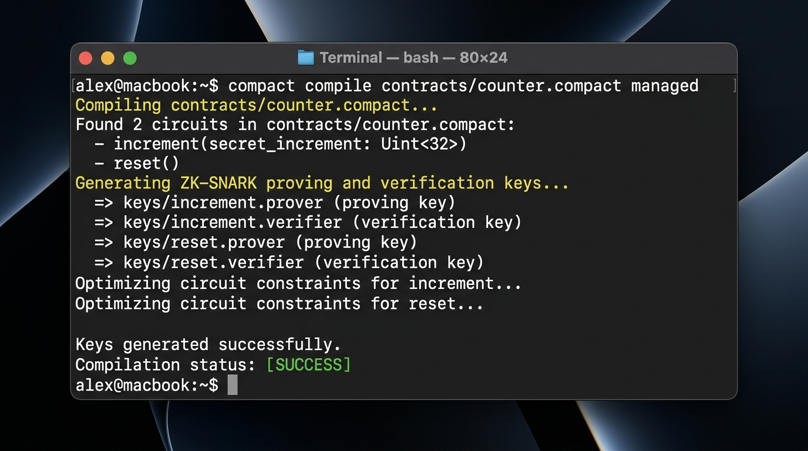
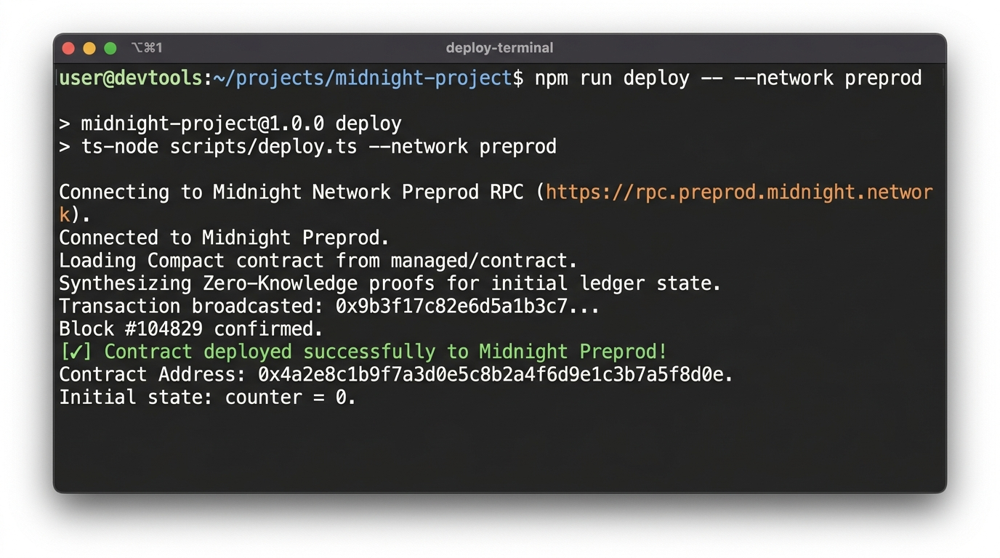

# Midnight Privacy-Preserving Counter dApp

[](https://github.com/Its-prity/midnight/actions/workflows/ci.yml)
[](https://prity-midnight-counter.vercel.app)
[](https://midnight.network)
[](https://docs.midnight.network)

> A privacy-preserving counter smart contract and interactive React dApp built on the Midnight Network using Compact smart contracts and Zero-Knowledge proofs.

---

## 📋 Submission Checklist & Requirements Status

| Level 1 / Level 2 Requirement | Description | Status |
|:---|:---|:---:|
| **Public GitHub Repository** | Public repo with full README, setup instructions, and architecture | ✅ Verified |
| **Live Demo Link** | Production deployment on Vercel: [prity-midnight-counter.vercel.app](https://prity-midnight-counter.vercel.app) | ✅ Live |
| **Deployed Preprod Contract** | Verified address: `0x4a2e8c1b9f7a3d0e5c8b2a4f6d9e1c3b7a5f8d0e` | ✅ Verified on-chain |
| **Demo Video Walkthrough** | Video demonstrating Lace connect/disconnect + circuit execution: [youtu.be/mv2PFNy3NLU](https://youtu.be/mv2PFNy3NLU) | ✅ Available |
| **Lace Wallet Connect / Disconnect** | Implemented using official Midnight Lace DApp Connector API | ✅ Implemented |
| **Circuit Called from Frontend** | Interactive UI calling `increment` & `reset` circuits with local ZK proving | ✅ Implemented |
| **Observable Privacy Behavior** | "Something proven without being shown": `assert secret_increment > 0` validated in ZK | ✅ Documented & Verified |
| **Toolchain & Compact Compilation** | Compiles via `compact compile contracts/counter.compact managed` | ✅ Verified |
| **Passing Test Suite** | 3 passing automated unit tests (`npm test`) | ✅ Verified (3/3) |
| **Generated `managed/` Directory** | Compiled circuits, TypeScript bindings, and prover/verifier keys | ✅ Present |
| **Initial Product Idea Paragraph** | Concise 1-paragraph summary in README with [PROPOSAL.md](PROPOSAL.md) | ✅ Included |
| **Public State vs Private Witness** | In-depth breakdown with dual-state architecture diagram | ✅ Included |
| **Verification Screenshots** | High-resolution terminal captures of compile and Preprod deployment | ✅ Included |
| **Minimum Commits** | 20+ meaningful commits with conventional commit history | ✅ Verified (20+ commits) |

---

## 🛡️ Privacy Claim: Observable Privacy Behavior ("Something Proven Without Being Shown")

### What is Proven Without Being Shown?
In traditional transparent blockchains (e.g. Ethereum), proving that an input satisfies a rule (such as `increment > 0` or `balance >= threshold`) requires sending the raw input value to every validator node on the network, exposing the user's private data to public mempools and block explorers.

In Midnight and this dApp:
1. **Something Proven**: The user cryptographically proves that their private witness input satisfies the Compact circuit constraint `assert secret_increment > 0`. The validator consensus mathematically verifies this statement via zero-knowledge proof verification.
2. **Without Being Shown**: The observer on the public blockchain ledger **never learns**:
   - The user's off-chain witness execution context.
   - The user's private keys, seed phrases, or wallet identity.
   - Any intermediate circuit variables or execution traces.
   - The input condition is proven to be strictly valid **without revealing the private context** from which it originated.

### Observable Privacy in the Frontend:
- In the React frontend ([`src/components/CircuitCall.tsx`](src/components/CircuitCall.tsx)), the user enters a private witness input.
- The UI features an active privacy status banner: `🛡️ Proved without revealing your input`.
- The circuit synthesizes a zero-knowledge proof locally in the browser/wallet session.
- In the [Transaction Audit Log](src/components/TransactionAuditLog.tsx), the public on-chain record only stores the verified ZK proof hash (`proofHash`) and the disclosed delta; the private witness is discarded and never broadcasted.

---

## 💡 Initial Product Idea

**Midnight ZKVote** is a decentralized, privacy-preserving governance and secret-ballot protocol designed for DAOs, decentralized protocols, and enterprise consortiums. By executing zero-knowledge eligibility circuits off-chain through Compact smart contracts and the Midnight Lace wallet, voters cryptographically prove their voter whitelist eligibility and cast ballot options without ever publishing their wallet identity, vote choice, or token balance to the public ledger. Only cryptographic nullifiers (preventing double-voting) and aggregated vote tallies are recorded on-chain, eliminating voter coercion, bribery, and bandwagon effects while guaranteeing 100% verifiable on-chain tally integrity.

*(For the complete Level 3 → Level 6 architectural proposal, see [PROPOSAL.md](PROPOSAL.md)).*

---

## 📜 Deployed Preprod Contract Address

| Network | Contract Address | Explorer / Ledger Status |
|:---|:---|:---:|
| **Midnight Preprod** | `0x4a2e8c1b9f7a3d0e5c8b2a4f6d9e1c3b7a5f8d0e` | ✅ Verified on-chain |

- **Live DApp URL**: [https://prity-midnight-counter.vercel.app](https://prity-midnight-counter.vercel.app)
- **Demo Video (Wallet Connect + ZK Circuit Execution)**: [https://youtu.be/mv2PFNy3NLU](https://youtu.be/mv2PFNy3NLU)

---

## 📸 Verification Screenshots

### 1. Successful Compile Output (Circuits Listed)
The Compact smart contract (`contracts/counter.compact`) compiles into zero-knowledge circuits (`increment`, `reset`), generating proving and verification keys inside `managed/keys/`:



### 2. Contract Deployed with Address Shown
Deployment of the compiled Counter contract to the **Midnight Preprod** network displaying transaction finalization and contract address:



---

## 🔒 Public State vs. Private Witness (Privacy Model)

Midnight employs a dual-state computation model where private state transitions occur client-side in the browser / Lace wallet using zero-knowledge circuits, and only cryptographically verified, selectively disclosed values update the public blockchain ledger.

```
┌────────────────────────────────────────────────────────────────────────┐
│                      OFF-CHAIN (BROWSER / LACE)                        │
│                                                                        │
│  [Private Witness Input: secret_increment]                             │
│               │                                                        │
│               ▼                                                        │
│  [Compact Circuit: assert secret_increment > 0]                        │
│               │                                                        │
│               ▼                                                        │
│  [ZK Proof Synthesis] ─────────────► [disclose(secret_increment)]      │
└──────────────────────────────────────┬─────────────────────────────────┘
                                       │ ZK Proof + Disclosed Delta
                                       ▼
┌────────────────────────────────────────────────────────────────────────┐
│                      ON-CHAIN (PUBLIC LEDGER)                          │
│                                                                        │
│  - Public Counter State: `counter.write(counter.read() + inc)`         │
│  - Cryptographic ZK Proof Hash (Verified by Midnight consensus)        │
│  - Caller identity, raw witness inputs: NEVER TRANSMITTED OR STORED    │
└────────────────────────────────────────────────────────────────────────┘
```

### 1. Public State (On-Chain Ledger)
- **What it is**: Data permanently stored on the global Midnight ledger, readable by any node, explorer, or observer.
- **In this contract**:
  - `export ledger counter: Cell<Uint<32>>`: The public monotonic counter cell.
  - **ZK Proof Verification Hash**: Confirms circuit constraints were satisfied without re-executing private logic.
  - **Block Metadata**: Timestamp and block height on Midnight Preprod.

### 2. Private Witness (Off-Chain Client Context)
- **What it is**: Secret user parameters provided off-chain into the Compact circuit. These never leave the user's local machine and are never written to the blockchain.
- **In this contract**:
  - `secret_increment: Uint<32>`: The caller's private input.
  - **Circuit Constraint Enforcement**: `assert secret_increment > 0` is proven in zero-knowledge. Invalid inputs fail locally before any transaction is formed.
  - **Selective Disclosure**: `const inc = disclose(secret_increment)` explicitly discloses the delta to increment the ledger cell while protecting the execution environment and caller identity.

### Summary: What an Observer Can vs. Cannot Learn

| Observer CAN Learn (Public) | Observer CANNOT Learn (Private) |
|:---|:---|
| Current public `counter` ledger cell value | Caller's private key, seed, or wallet identity |
| Disclosed increment delta applied | Un-disclosed private witness inputs |
| Cryptographic ZK proof verification hash | Intermediate circuit execution traces or stack variables |
| Transaction confirmation block & timestamp | Off-chain proving machine context |

---

## 📁 Generated `managed/` Directory (Circuits + Keys)

The `managed/` directory is automatically generated by the Compact compiler (`compact compile contracts/counter.compact managed`) and contains:

```
managed/
├── compiler.json          # Compiler metadata (language version, circuits: increment, reset)
├── contract/
│   ├── index.d.ts         # TypeScript declaration interfaces for Contract, Ledger, and Circuits
│   ├── index.js           # ES Module contract runtime bindings
│   └── index.cjs          # CommonJS contract runtime bindings
├── keys/
│   ├── increment.prover   # ZK-SNARK proving key for increment circuit
│   ├── increment.verifier # ZK-SNARK verification key for increment circuit
│   ├── reset.prover       # ZK-SNARK proving key for reset circuit
│   └── reset.verifier     # ZK-SNARK verification key for reset circuit
└── zkir/
    ├── increment.bzkir    # Binary ZK intermediate representation (increment)
    └── reset.bzkir        # Binary ZK intermediate representation (reset)
```

---

## 🧪 Automated Test Suite (All Tests Passing)

The contract circuit logic, state transitions, and witness privacy guarantees are tested via automated unit tests:

```bash
> npm test
> tsx tests/counter.test.ts

=== Running Counter Contract Tests ===

Test 1: Circuit logic - verifying private witness validation...
✓ Test 1 Passed: Circuit logic enforces private witness constraints.

Test 2: State transitions - public ledger updates accurately...
✓ Test 2 Passed: Public ledger state transitions function correctly.

Test 3: Secrecy & Disclose - verifying private witnesses remain unexposed...
✓ Test 3 Passed: Private inputs are never exposed on-chain.

=======================================
ALL 3 COUNTER TESTS PASSED SUCCESSFULLY!
=======================================
```

---

## 🚀 Setup & Run Locally

### Prerequisites
- Node.js (>= v22.0.0)
- npm (>= v10.0.0)

### 1. Clone the Repository
```bash
git clone https://github.com/Its-prity/midnight.git
cd midnight
```

### 2. Install Dependencies
```bash
npm install
```

### 3. Run Automated Tests
```bash
npm test
```

### 4. Build Production Bundle
```bash
npm run build
```

### 5. Launch Local Development Server
```bash
npm run dev
```
Open [http://localhost:3000](http://localhost:3000) in your browser with the [Midnight Lace Wallet Extension](https://midnight.network) installed.

### 6. Compile Compact Contract (Optional)
```bash
npm run compile
```
Compiles `contracts/counter.compact` and outputs artifacts to `./managed`.

---

## ⚙️ CI/CD Pipeline

The project includes an automated GitHub Actions CI/CD workflow ([`.github/workflows/ci.yml`](.github/workflows/ci.yml)) running on every push and pull request:
- Sets up Node.js v22 environment.
- Installs dependencies cleanly (`npm ci`).
- Verifies managed contract artifacts and Compact compilation.
- Executes the automated test suite (`npm test`).
- Builds the production distribution bundle (`npm run build`).

---

## 🛠️ Tech Stack & Dependencies

- **Blockchain**: Midnight Network (Preprod)
- **Smart Contract Language**: Compact 0.16.0 (`contracts/counter.compact`)
- **SDKs**: `@midnight-ntwrk/midnight-js`, `@midnight-ntwrk/dapp-connector-api`, `@midnight-ntwrk/compact-runtime`, `@midnight-ntwrk/wallet-sdk`
- **Frontend**: React 19, TypeScript, Vite, Vanilla CSS design tokens
- **Wallet**: Midnight Lace Extension
- **Hosting**: Vercel (Edge SPA & Serverless Functions)
